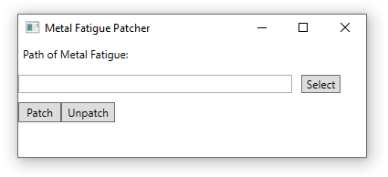

# MetalFatiguePatcher
This project exists to fix the crash due to "too little memory available" in the game Metal Fatigue.

With this release, the RAM crash bug has been fixed. Especially in the multiplayer of the Steam version of Metal Fatigue there were crashes if there were too many units in the game.

However, the unit limit, which only applies to the host and the bots in multiplayer, but not to other players, has still not been increased.

Software requirements: .NETFramework in Version=v4.7.2

Compiled and testet with Visual Studio 2019

### [Download on SourceForge](https://sourceforge.net/projects/metalfatiguepatchproject/)

