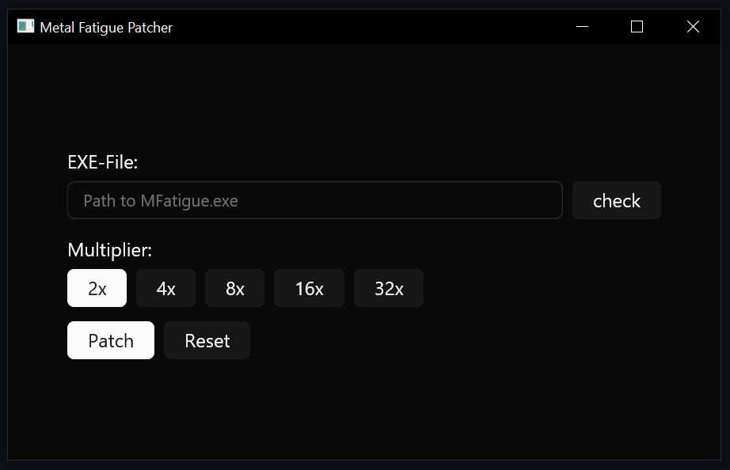

# MetalFatiguePatcher
This project exists to fix the crash due to "too little memory available" in the game Metal Fatigue.

With this release, the RAM crash bug has been fixed. Especially in the multiplayer of the Steam version of Metal Fatigue there were crashes if there were too many units in the game.

However, the unit limit, which only applies to the host and the bots in multiplayer, but not to other players, has still not been increased.

#### 2026:
The tool has been ported to Rust and now uses GPUI-component as its GUI framework. It is now also possible to select options other than doubling the allocated memory in the patched call. Furthermore, the licence has changed to MIT.

### [Download on SourceForge](https://sourceforge.net/projects/metalfatiguepatchproject/)
